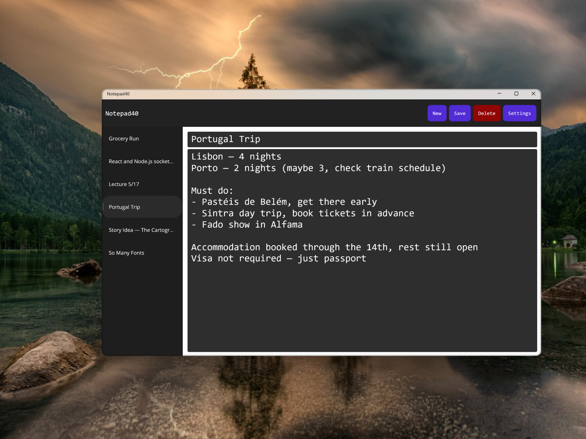
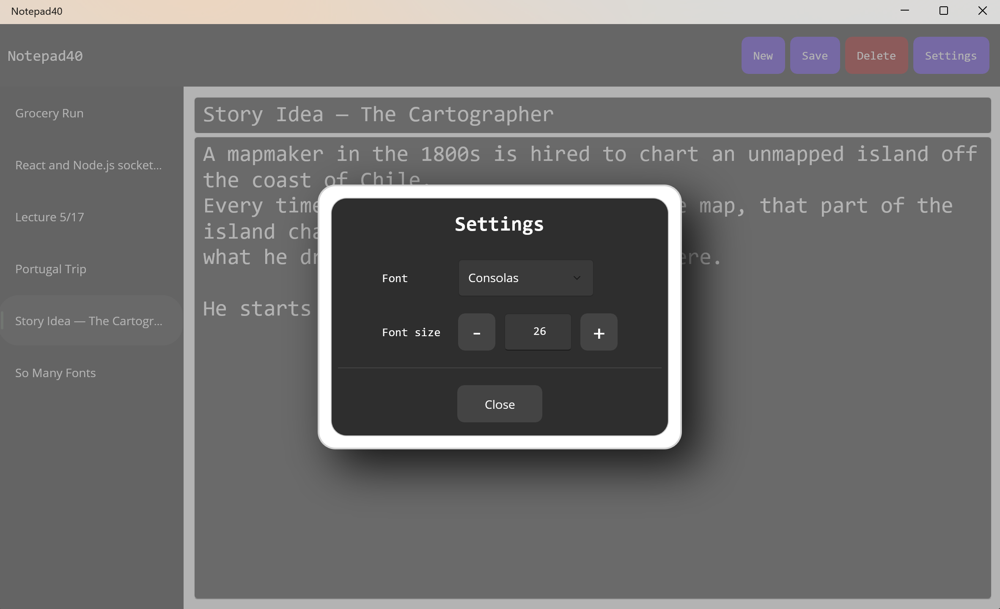
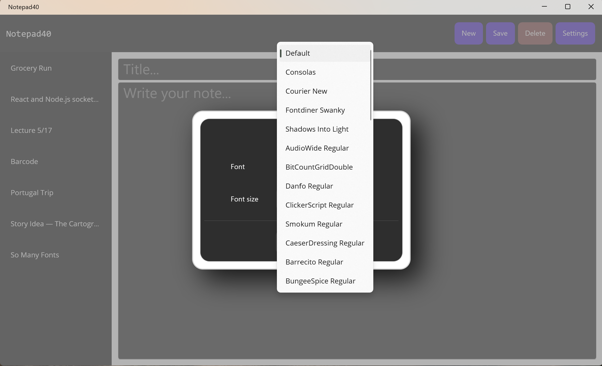
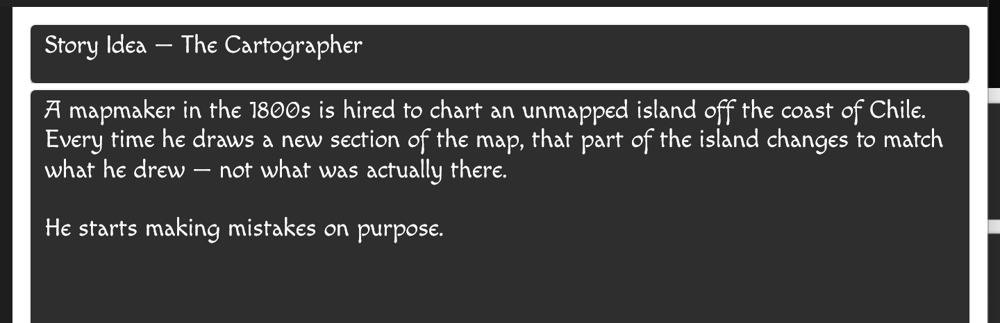
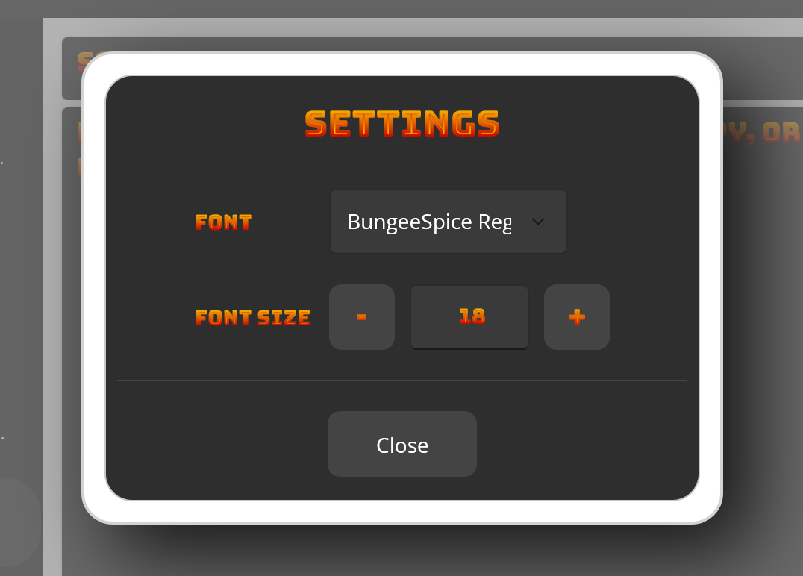
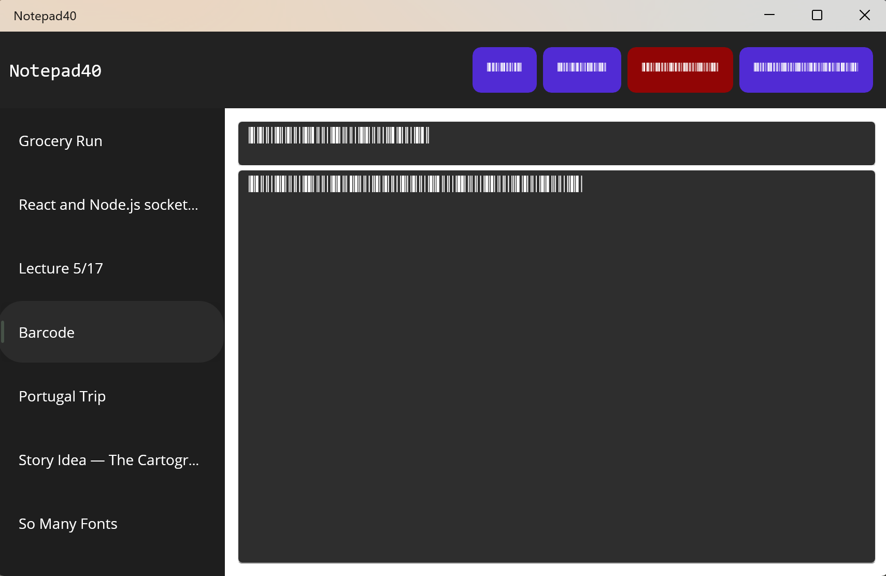
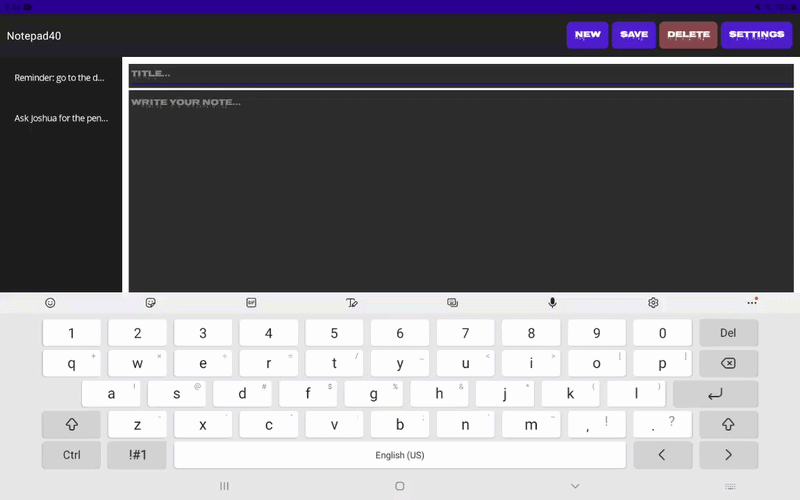

<h1 align="center">Notepad40</h1>
<p align="center">
  A simple, cross-platform notepad app built for convenience and simplicity.
</p>
<p align="center">
  
  &nbsp;
  
  &nbsp;
  
</p>
<br/>
<p align="center">
  
</p>

---

## Basic Features:
- Add a note
- Delete a note
- Update existing note
- Swap active/selected
- See customization features below

---

## ⚙️ Settings

Customize your experience with the settings popup. Click outside the popup to quickly dismiss it, no hunting for an X in the corner. This is especially smooth on mobile.

<p align="center">
  
</p>
<div><br>
Font size and style are both configurable through a dropdown containing 40+ fonts.
<br><br>
</div>
<p align="center">
  
  <br/>
  <em>Font selector dropdown</em>
</p>

---

## 🪶 Fonts

Here are some of the fonts in the app.

<p align="center">
  
</p>
<p align="center">
  
</p>
<p align="center">
  
  <br/>
  <em>A barcode font. Unfortunately, you can't scan it.</em>
</p>

---

## ⌨️ Keyboard Shortcuts

Several keyboard shortcuts are available for quick navigation:

| Shortcut | Action |
|---|---|
| <kbd>Ctrl</kbd> + <kbd>S</kbd> | Save the note |
| <kbd>Ctrl</kbd> + <kbd>N</kbd> | New note |
| <kbd>Ctrl</kbd> + <kbd>Del</kbd> | Delete the note |
| <kbd>Esc</kbd> | Close the settings popup |
| <kbd>Ctrl</kbd> + <kbd>W</kbd> | Close the app |
| <kbd>Ctrl</kbd> + <kbd>+</kbd> | Zoom In |
| <kbd>Ctrl</kbd> + <kbd>-</kbd> | Zoom Out |

---

## Platform-Specific Behaviors

Each platform gets an experience tailored to its strengths. On mobile, actions trigger a toast notification while on desktop the button briefly shrinks instead.

<p align="center">
  
</p>

---

## 🚀 Getting Started

<details open>
<summary><strong>Run the App Now</strong></summary>
<br>

Download the latest release for your platform:

-  **Windows** — [Download .zip](https://github.com/alexirez/Notepad40/releases/download/v2.3.0/Notepad40-v2.3.0-windows.zip) · Unzip and run `Notepad40.exe`
-  **Android** — [Download .apk](https://github.com/alexirez/Notepad40/releases/download/v2.3.0/Notepad40-Signed.apk) · Enable installs from unknown sources when prompted
> **Note:** iOS builds require a Mac with Xcode and an Apple Developer account. As a result, an iOS release is not currently available.

</details>

<details>
<summary><strong>Design Architecture</strong></summary>
<br>
<ul>
  <li>MVVM + services</li>
  <li>Compiler directives for platform-specific behaviors</li>
  <li>UI elements have as much behavior in code-behinds as possible to keep ViewModels clean</li>
</ul>
</details>

<details>
<summary><strong>Build and Run</strong></summary>
<br>

**Prerequisites**
- [.NET 10 SDK](https://dotnet.microsoft.com/download)
- [Visual Studio 2022](https://visualstudio.microsoft.com/) with the .NET MAUI workload
- Android SDK (for Android builds)
- A Mac with Xcode (for iOS builds)

**Clone the repository**
```bash
git clone https://github.com/alexirez/Notepad40.git
cd Notepad40
```

**Windows**
```bash
dotnet build -f net10.0-windows10.0.19041.0 -c Debug
dotnet run -f net10.0-windows10.0.19041.0
```

**Android** *(requires a connected device or emulator)*
```bash
dotnet build -f net10.0-android -c Debug
dotnet run -f net10.0-android
```

**iOS** *(requires a Mac)*
```bash
dotnet build -f net10.0-ios -c Debug
dotnet run -f net10.0-ios
```

</details>

<details>
<summary><strong>Development Notes</strong></summary>
<br>

.NET MAUI is still in active development, so a few workarounds were needed while working on the app:

- **Notes list not updating** — the standard binding did not refresh the list reliably, so a custom `Preview` binding was attached directly to the note model as a workaround
- **Font size not reflecting in sidebar** — font size changes are not reflected on note previews in the side panel during debug builds. However, this works correctly in release builds

**Known Bugs**
- Saving occasionally causes a crash
- Font style is not reflected on note previews in the notes list (likely a MAUI bug)

</details>

<details>
<summary><strong>Attributions</strong></summary>
<br>

- screenshot mockups created with [shots.so](https://shots.so)
- fonts taken from [Google Fonts](https://fonts.google.com)
- platform icons: [SVG Repo](https://www.svgrepo.com)

</details>

---

## 📜 License

Distributed under the MIT License. See `LICENSE` for more information.
